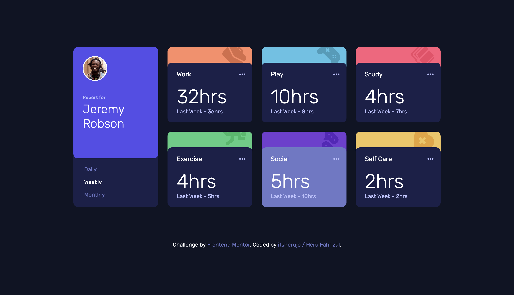

# Frontend Mentor - Time tracking dashboard solution

This is a solution to the [Time tracking dashboard challenge on Frontend Mentor](https://www.frontendmentor.io/challenges/time-tracking-dashboard-UIQ7167Jw). Frontend Mentor challenges help you improve your coding skills by building realistic projects. 

## Table of contents

- [Overview](#overview)
  - [The challenge](#the-challenge)
  - [Screenshot](#screenshot)
  - [Links](#links)
- [My process](#my-process)
  - [Built with](#built-with)
  - [What I learned](#what-i-learned)
  - [Useful resources](#useful-resources)
- [Author](#author)

## Overview

### The challenge

Users should be able to:

- View the optimal layout for the site depending on their device's screen size
- See hover states for all interactive elements on the page
- Switch between viewing Daily, Weekly, and Monthly stats

### Screenshot

### Links

- Solution URL: [https://www.frontendmentor.io/solutions/time-tracking-dashboard-s989KB44az](https://www.frontendmentor.io/solutions/time-tracking-dashboard-s989KB44az)
- Live Site URL: [https://time-tracking-dashboard-byjo.netlify.app/](https://time-tracking-dashboard-byjo.netlify.app/)

## My process

### Built with

- HTML5 markup
- CSS custom properties
- Flexbox
- CSS Grid
- Desktop-first workflow

### What I learned

One important lesson I learned is how to use JavaScript to dynamically update HTML elements based on JSON data, while also ensuring default values are displayed before any interaction. I also realized the significance of handling different time periods (like daily, weekly, monthly) and updating the content.

### Useful resources

- [Font Awsome](https://fontawesome.com/) - This helped me to get free icons. I really liked this pattern and will use it going forward.

## Author

- Frontend Mentor - [@itsherujo](https://www.frontendmentor.io/profile/itsherujo)

# time-tracking-dashboard
